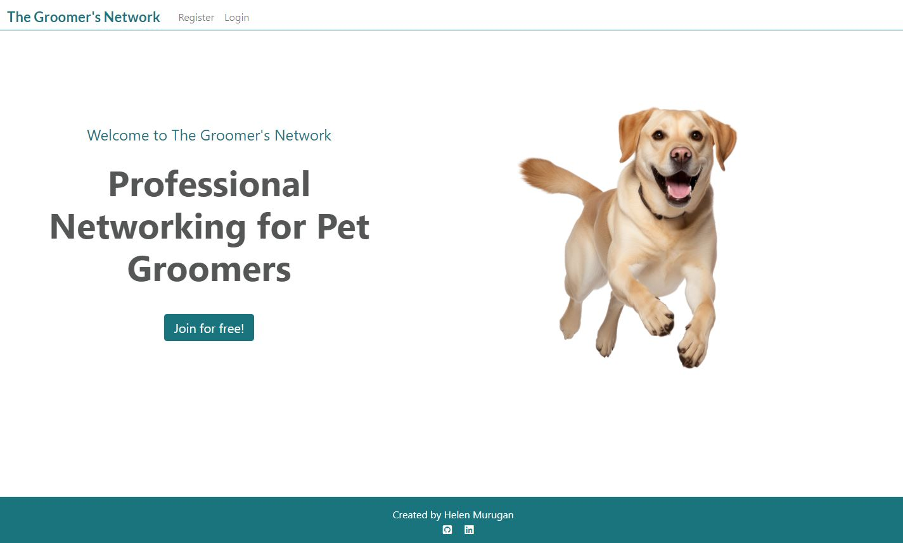

# The Groomer's Network

Developer: [Helen Murugan](https://github.com/helenmurugan) 
Deployed website: [Link to website](https://.com) 

The Groomer's Network is a Django web application that allows pet grooming professionals to network and access information about upcoming events. It has a registration/login system that allows users to create and manage a personalised profile. Users can post content to promote themselves, share information and network with other users. They can also access information about upcoming grooming workshops, seminars and competitions.

---
## Contents
- [Project Goals](#project-goals)
    + [User Goals](#user-goals)
    + [Site Owner Goals](#site-owner-goals)
    + [Justification](#justification)
    + [Target Audience](#target-audience)
    + [User Stories](#user-stories)
- [Planning](#planning)
    + [Agile methodology](#agile-methodology)
    + [Database](#database)
- [UX Design](#ux-design)
    + [Wireframes](#wireframes)
    + [Colour](#colour)
    + [Fonts](#fonts)
    + [Structure](#structure)
- [Features](#features)
    + [Landing Page](#landing-page)
    + [Posts/Home Page](#postshome-page)
    + [Events Page](#events)
    + [User Profile](#user-profile)
    + [Registration/Log in](#registrationlog-in)
    + [Navigation](#navigation)
    + [Future Development](#future-development)
- [Testing](#testing)
- [Bugs](#bugs)
    + [Fixed Bugs](#fixed-bugs)
    + [Unfixed Bugs](#unfixed-bugs)
- [Technologies Used](#technologies-used)
    + [Languages](#languages)
    + [Frameworks](#frameworks)
    + [Database](#database)
    + [Technologies and Programs](#technologies-and-programs)
    + [Supporting Libraries and Packages](#supporting-libraries-and-packages)
- [Deployment](#deployment)
    + [ElephantSQL](#elephantsql)
    + [Cloudinary](#cloudinary)
    + [Before Deployment](#before-deployment)
    + [Deployment to Heroku](#deployment-to-heroku)
    + [Forking](#Forking)
    + [Cloning](#cloning)
- [Credits](#credits)
    + [Code](#code)
    + [Media](#media)
    + [Content](#content)
    + [Documentation and Useful Blogs](#documentation-and-useful-blogs)
    + [Acknowledgements](#acknowledgents)

---
## Project Goals

### User Goals
- Intuitive and easy navigation around the site.
- Dedicated platform for like-minded grooming professionals.
- Personalised profiles to enable the user to highlight their accomplishments within the grooming community.
- Engaging posts and events that benefit the user through sharing of knowledge.
- Sharing of knowledge, promote professional accomplishments and network through posts.
- Interaction with content through comments and likes.
- Responsive design. Users can expect the application to work on all their devices.

### Site Owner Goals
- Site management through a dedicated admin panel, allowing administrators to manage user accounts, moderate content and promote grooming events.
- A platform which fosters a sense of community and raises professional standards.

### Justification
- Currently, professional pet groomers use private Facebook pages as a platform to ask questions to other groomers and promote events. The pages are very active and can be difficult to manage.
- The Groomer's Network provides a dedicated setting that encourages a more professional approach to networking. The majority of pet grooming professionals work alone, as small business owners, and therefore the need for this type of platform is real, to enhance professional standards through sharing of information.
- Often grooming events such as seminars, workshops, training and competitions are promoted solely on private Facebook pages which can be restrictive. The Groomer's Network provides an alternative site where events can be listed in one place.

### Target Audience
The Groomer's Network is designed for UK pet grooming professionals who:
- Are committed to improving professional standards through sharing information.
- Seek to improve their knowledge and skills by attending professional events.
- Seek to network with others and raise their profile within the grooming community.
- Wish to stay updated with the latest trends, technologies and standards in their profession.

### User Stories 

Epic 1: New User Experience
- [Visually Appealing Landing Page](https://github.com/helenmurugan/the-groomers-network/issues/27) - As a Site User, I am welcomed by a visually appealing landing page with intuitive navigation so that I can select to register or sign in to the site.
- [Account Registration](https://github.com/helenmurugan/the-groomers-network/issues/5) - As a Site User, I can register for an account so that I can sign in and have access to the complete functionality of the site.
- [Immediate feedback through messages](https://github.com/helenmurugan/the-groomers-network/issues/39) - As a Site User, I can immediately receive feedback when I make changes to data so that I understand what action I have just performed.

Epic 2: User Interaction With Posts and Comments
- [Create and Manage Posts](https://github.com/helenmurugan/the-groomers-network/issues/8) - As a Site User, I can create and manage my own posts so that I can network with other users.
- [Images](https://github.com/helenmurugan/the-groomers-network/issues/30) - As a Site User, I can upload and view images so that posts are meaningful and engaging.
- [View Posts](https://github.com/helenmurugan/the-groomers-network/issues/1) - As a Site User, I can view a list of posts so that I can click on a post to view the full content
- [Site Pagination for Posts](https://github.com/helenmurugan/the-groomers-network/issues/17) - As a Site User, I can view several posts on each page so that I can easily navigate between pages.
- [Interact Using Comments](https://github.com/helenmurugan/the-groomers-network/issues/20) - As a Site User, I can manage my comments on posts so that I can be a part of the conversation.
- [Like/Unlike Posts](https://github.com/helenmurugan/the-groomers-network/issues/7) - As a Site User, I can like or unlike a post so that I can interact with the content.

Epic 3: Events
- [View Events](https://github.com/helenmurugan/the-groomers-network/issues/19) - As a Site User, I can view a list of events and click on an event so that I can read the full content.
- [Site Pagination for Events](https://github.com/helenmurugan/the-groomers-network/issues/37) - As a Site User, I can view several events on each page so that I can easily navigate between pages.
- [Like/Unlike Comments](https://github.com/helenmurugan/the-groomers-network/issues/3) - As a Site User, I can like or unlike an event so that I can interact with the content.
- [Create and Manage Events](https://github.com/helenmurugan/the-groomers-network/issues/35) - As a Site Admin, I can create and manage events so that they can be shared with the user.

Epic 4: User Profiles
- [User Profile](https://github.com/helenmurugan/the-groomers-network/issues/25) - As a Site User, I can manage my profile so that I can display and update my details as necessary.
- [View Other User's Profiles](https://github.com/helenmurugan/the-groomers-network/issues/36) - As a Site User, I can click on the username of another user so that I can view their profile.

Epic 5: Administration and Site Management
- [Site Management](https://github.com/helenmurugan/the-groomers-network/issues/16) - As a Site Admin, I can use a dedicated admin panel so that I can delete any inappropriate content and manage the content of the site.
---
## Planning

### Database
Profile Table
Post Table
Events Table
Comments Table

### Agile Methodology
Agile methodologies and principles were used when planning and creating The Groomer's Network.

---
## UX Design
The principles of good UX design were followed when designing and creating The Groomer's Network.
### Wireframes
### Colour
### Fonts
### Structure

---
## Features
### Landing Page
### Posts/Home Page
### Events Page
### User Profile
### Registration/Log in
### Navigation
### Future Development
---
## Testing
The application has been thoroughly tested and code validated. All testing documentation can be found in the separate [TESTING.md](/TESTING.md) file.
---
## Bugs
### Fixed Bugs
### Unfixed Bugs
---
## Technologies Used
### Languages
### Frameworks
### Database
### Technologies and Programs
### Supporting Libraries and Packages
- widget_tweaks for modifying the allauth signup form - see blog link below
---
## Deployment
### ElephantSQL
An external database was created in ElephantSQL using the following steps
1. Log in to ElephantSQL and select 'Create New Instance'
2. Select a plan, input your details and review.
3. Once created, use the copy icon to copy the DATBASE_URL.

### Cloudinary
Cloudinary was used to store static and media files.
1. Log in to Cloudinary
2. Copy your CLOUDINARY_URL

### Before Deployment
Important points for before deployment
1. The requirements for the project were added to a requirements.txt file using the command 'pip3 freeze > requirements.txt' in the terminal.
2. In .gitignore, include env.py to ensure sensitive information is not pushed to GitHub.
3. In settings.py, set 'DEBUG = False' to prevent verbose error pages and to prevent Django serving static files itself instead of relying on Cloudinary.

### Deployment to Heroku
This app was deployed to Heroku using the following steps.
1. Log in to Heroku and from the Dashboard, select 'Create New App'
2. Create a unique name for your app, and select your location.
3. Open the settings tab, Click 'Reveal Config Vars'. I added the following Config Vars for this project:
- DATABASE_URL
- DISABLE_COLLECTSTATIC = 0 (Note this is set to 1 during development)
- SECRET_KEY
- CLOUDINARY_URL
4. Click 'Add buildpack'. The buildpacks will install further dependencies that are not included in the requirements.txt. For this project, the buildpack required is Python.
5. Select the Deploy tab
6. When successfully built, a message appears showing the URL'https://the-groomers-network-96ece9118f5d.herokuapp.com/ deployed to Heroku'. Click 'Open App' to view the deployed app.

### Forking
1. From the GitHub repository, click on 'Fork', 'Create a Fork'
2. Change the name and description of the fork as required.
3. Select to copy only the main branch or copy all branches.
4. Click 'Create a Fork'. A new repository will appear in your GitHub repositories if successful.

### Cloning
1. From the GitHub repository, click 'Code' and copy the link.
1. Open git bash and change the working directory to the desired location.
1. Enter 'git clone' and paste the link.
1. Press Enter to create your local clone.
---
## Credits
### Code
- Boilerplate code, navbar and footer code modified from Code Institute's walkthrough blog project.
- Signals code was taken and modified from Juliia Konovalova's [e-commerce project]().
- The code for 'get_success_url' function was taken and modified from Kim Bergstroem's [PP4 project](https://github.com/KimBergstroem/PP4).

### Media
- https://favicon.io/favicon-generator/
### Content

### Documentation and Useful Blogs
The following documentation, blogs, tutorials and guides were used to aid development.
- [Bootstrap](https://getbootstrap.com/docs/4.1/getting-started/introduction/)
- [Django](https://docs.djangoproject.com/en/5.0/)
- [Built with Django Blog](https://builtwithdjango.com/blog/styling-authentication-pages)
- [Sentry](https://sentry.io/welcome/)
- [Stack Overflow - Bootstrap Nav](https://stackoverflow.com/questions/25044370/make-clicked-tab-active-in-bootstrap)
- [Stack Overflow - Crispy Forms](https://stackoverflow.com/questions/11472495/remove-labels-in-a-django-crispy-forms)
- [Stack Overflow - User Profile](https://stackoverflow.com/questions/33724344/how-can-i-display-a-user-profile-using-django)
- [Widget Tweaks Documentation](https://pypi.org/project/django-widget-tweaks/)

### Acknowledgments
- Excellent mentoring and expert guidance from Juliia Konovalova and Spencer Barriball
- Inspiration on structure and design of templates taken from Kim Bergstroem's PP4 Gamer's Insight blog project.

 

