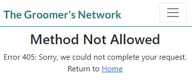

# The Groomer's Network

Developer: [Helen Murugan](https://github.com/helenmurugan) 
Deployed website: [Link to website](https://the-groomers-network-96ece9118f5d.herokuapp.com/) 

The Groomer's Network is a Django web application that allows pet grooming professionals to network. It has a registration/login system that allows users to create and manage a personalised profile. Users can post content to promote themselves, share information and interact with other users through likes and comments. Users can also access information about upcoming events such as grooming workshops, seminars and competitions.

---
## Contents
- [User Experience](#user-experience)
    + [User Stories](#user-stories)
    + [Site Goals](#site-goals)
    + [Justification](#justification)
    + [Target Audience](#target-audience)
- [UX Design](#ux-design)
    + [Wireframes](#wireframes)
    + [Colour](#colour)
    + [Fonts](#fonts)
    + [Database](#database)
    + [Models](#models)
- [Agile Methodology](#agile-methodology)
    + [Overview](#overview)
    + [EPICS](#epics)
    + [User Stories as Issues](#user-stories-as-issues)
    + [MoSCoW Prioritisation](#mosscow-prioritisation)
    + [GitHub Projects](#github-projects)
- [Features](#features)
    + [Navigation](#navigation)
    + [Landing Page](#landing-page)
    + [Registration](#registration)
    + [Login](#login)
    + [User Profile](#user-profile)
    + [Posts/Home Page](#postshome-page)
    + [Post Detail Page](#post-detail-page)
    + [Events Page](#events)
    + [Event Detail Page](#event-detail-page)
    + [Log out](#log-out)
    + [Admin Panel](#admin-panel)
    + [Future Development](#future-development)
- [Testing](#testing)
- [Bugs](#bugs)
    + [Fixed Bugs](#fixed-bugs)
    + [Unfixed Bugs](#unfixed-bugs)
- [Technologies Used](#technologies-used)
    + [Languages](#languages)
    + [Frameworks](#frameworks)
    + [Database](#database)
    + [Technologies and Programs](#technologies-and-programs)
    + [Supporting Libraries and Packages](#supporting-libraries-and-packages)
- [Deployment](#deployment)
    + [ElephantSQL](#elephantsql)
    + [Cloudinary](#cloudinary)
    + [Before Deployment](#before-deployment)
    + [Deployment to Heroku](#deployment-to-heroku)
    + [Forking](#Forking)
    + [Cloning](#cloning)
- [Credits](#credits)
    + [Code](#code)
    + [Media](#media)
    + [Content](#content)
    + [Documentation and Useful Blogs](#documentation-and-useful-blogs)
    + [Acknowledgements](#acknowledgents)

---
## User Experience

### User Stories 

EPIC 1: New User Experience
- [Visually Appealing Landing Page](https://github.com/helenmurugan/the-groomers-network/issues/27) - As a Site User, I am welcomed by a visually appealing landing page with intuitive navigation so that I can select to register or sign in to the site.
- [Account Registration](https://github.com/helenmurugan/the-groomers-network/issues/5) - As a Site User, I can register for an account so that I can sign in and have access to the complete functionality of the site.
- [Immediate feedback through messages](https://github.com/helenmurugan/the-groomers-network/issues/39) - As a Site User, I can immediately receive feedback when I make changes to data so that I understand what action I have just performed.

EPIC 2: User Interaction With Posts and Comments
- [Create and Manage Posts](https://github.com/helenmurugan/the-groomers-network/issues/8) - As a Site User, I can create and manage my own posts so that I can network with other users.
- [Images](https://github.com/helenmurugan/the-groomers-network/issues/30) - As a Site User, I can upload and view images so that posts are meaningful and engaging.
- [View Posts](https://github.com/helenmurugan/the-groomers-network/issues/1) - As a Site User, I can view a list of posts so that I can click on a post to view the full content
- [Site Pagination for Posts](https://github.com/helenmurugan/the-groomers-network/issues/17) - As a Site User, I can view several posts on each page so that I can easily navigate between pages.
- [Interact Using Comments](https://github.com/helenmurugan/the-groomers-network/issues/20) - As a Site User, I can manage my comments on posts so that I can be a part of the conversation.
- [Like/Unlike Posts](https://github.com/helenmurugan/the-groomers-network/issues/7) - As a Site User, I can like or unlike a post so that I can interact with the content.

EPIC 3: Events
- [View Events](https://github.com/helenmurugan/the-groomers-network/issues/19) - As a Site User, I can view a list of events and click on an event so that I can read the full content.
- [Site Pagination for Events](https://github.com/helenmurugan/the-groomers-network/issues/37) - As a Site User, I can view several events on each page so that I can easily navigate between pages.
- [Like/Unlike Comments](https://github.com/helenmurugan/the-groomers-network/issues/3) - As a Site User, I can like or unlike an event so that I can interact with the content.
- [Create and Manage Events](https://github.com/helenmurugan/the-groomers-network/issues/35) - As a Site Admin, I can create and manage events so that they can be shared with the user.

EPIC 4: User Profiles
- [User Profile](https://github.com/helenmurugan/the-groomers-network/issues/25) - As a Site User, I can manage my profile so that I can display and update my details as necessary.
- [View Other User's Profiles](https://github.com/helenmurugan/the-groomers-network/issues/36) - As a Site User, I can click on the username of another user so that I can view their profile.

EPIC 5: Administration and Site Management
- [Site Management](https://github.com/helenmurugan/the-groomers-network/issues/16) - As a Site Admin, I can use a dedicated admin panel so that I can delete any inappropriate content and manage the content of the site.

### Site Goals
1. To provide users with a place to network with other pet grooming professionals.
3. To provide a place where users can post information such as articles, blogs or questions.
4. To provide users with the ability to interact with content through comments and likes.
2. To provide users with a place to access information about grooming events.
3. To provide users with the ability to create a personalised profile to increase their visibility within the grooming community.
5. To make the site accessible and responsive to all devices.
6. To provide administrators with the ability to manage all contents of the site.

### Justification
- Currently, professional pet groomers use private Facebook pages as a platform to ask questions to other groomers and promote events. The pages are very active and can be difficult to manage.
- The Groomer's Network provides a dedicated setting that encourages a more professional approach to networking. The majority of pet grooming professionals work alone, as small business owners, and therefore the need for this type of platform is real, to enhance professional standards through sharing of information.
- Often grooming events such as seminars, workshops, training and competitions are promoted solely on private Facebook pages which can be restrictive. The Groomer's Network provides an alternative site where all events can be listed in one place.

### Target Audience
The Groomer's Network is designed for pet grooming professionals who:
- Are committed to improving professional standards through sharing information.
- Seek to improve their knowledge and skills by attending professional events.
- Seek to network with others and raise their profile within the grooming community.
- Wish to stay updated with the latest trends, technologies and standards in their profession.

---
## UX Design
The principles of good UX design were followed when designing and creating The Groomer's Network, as detailed in this section.

### Wireframes
Wireframes were created during planning of this project using [Balsamiq Cloud](#https://balsamiq.cloud/).

* Landing Page

* Registration Page

* Login Page

* Home

* Post Detail Page

* Events Page

* Event Detail Page

* Profile Page

### Colour
The following colours were selected for this project, with the intention of creating an environment that is calm, professional and visually appealing. The colour palette tool used during the design process was [Coolors](#https://coolors.co/).

### Fonts
Lato was chosen from [Google Fonts](#https://fonts.google.com/specimen/Lato) as the font for this website. It is simple, easy to read and appropriate for a professional site.

### Database
An entity-relationship diagram was created using [dbdiagram.io](https://dbdiagram.io).

### Models

1. User Table
    * The User model is built into Django AllAuth and is used for user authentication. 
    * Predefined fields for username, email and password come as standard. 
1. Profile Table
    * The profile model is a custom model that enables users to create a personalised profile.
    * The profile model is related to the user model with one-to-one relationship. One User can have one profile. 
    * Signals are used to automatically create a related profile when a new user is registered.
    * The profile table stores additional information that a user inputs to their profile. All profile fields except username are optional because the fields need to empty when the profile is created.
1. Post Table 
    * The post table represents posts created by users.
    * One user can be the author of many posts, a one-to-many relationship.
    * The timestamp that the post was created on and the title of the post are concatenated to form a unique slug.
    * Likes and users are related by a many-to-many relationship. A user can like many posts and a post can be liked by many users.
    * Useful information is stored in the post table and displayed to the user such as title, tagline, author, content, image and date published. 
1. Comments Table
    * The comment table enables users to comment on posts.
    * Many comments can be related to one post, a many-to-one relationship.
    * Useful information is stored in the comment table and displayed to the user such as body, author, date published.
1. Events Table
    * The event table is a custom model that represents events created by users (admin-only).
    * One user can be the author of many posts, a one-to-many relationship.
    * Likes and users are related by a many-to-many relationship. A user can like many posts and a post can be liked by many users.
    * Useful information is stored in the event table and displayed to the user such as title, tagline, content, image, date, time and location.

---
## Agile Methodology
### Overview
Agile methodologies and principles were used when planning and creating The Groomer's Network. Development was organised by working in sprints, focussed on a specific user story or stories, which could then be marked as complete. The user stories are arranged on a KanBan board, which was continuously managed throughout development to enable prioritisation of the workload.

### EPICS
Epics were used to plan the high-level bodies of work that needed to be accomplished. Customised colour-coded labels were added to user stories to show which EPICS they belong to.

EPIC 1: New User Experience

EPIC 2: User Interaction With Posts and Comments

EPIC 3: Events

EPIC 4: User Profile

EPIC 5: Administration and Site Management

### User Stories as Issues
The EPICS are broken down into user stories which are further broken down into acceptance criteria and tasks. The full list of user stories can be found in the [User Experience](#user-experience) section.

### MoSCoW Prioritisation
Labels were added to user stories to assist with prioritisation of tasks. The MoSCoW system involves adding labels for MUST HAVE, SHOULD HAVE, COULD HAVE and WON'T HAVE. By labelling issues in such a way, the developer can focus on completing all the MUST HAVE tasks before moving onto tasks of lower priority, this is critical when working to a tight deadline to ensure a minimum viable product is completed in time.

### GitHub Projects
The project was organised using a KanBan board containing columns for TO DO, IN PROGRESS, DONE and BACKLOG. The board is considered a live document, and was continuously managed between sprints to organise and prioritise workload effectively. Backlog was used to list bugs that required fixing. In future,  backlog can be used as a broad list of items to be done, including those that are not yet scheduled for immediate action. Once ready for action, the item is pulled into TO DO, then IN PROGRESS and finally DONE when said item is completed.

A link to the GitHub project board can be found [here](https://github.com/users/helenmurugan/projects/8)

---
## Features
### Navigation
* The navbar features on all pages. It is fully responsive and was built using Bootstrap.
* For unauthorised users, the navbar features links to Register and Login.
* For authorised users, the navbar provides links to Home, Events, My Profile and Logout. In addition, the logo acts as a link back to the landing page.
* The active nav link appears black (as opposed to grey) to show the user which page they are currently on.
* At screen sizes of 991px and below, a collapsible nav icon is used.

Navbar Images

 

 

### Landing Page
The landing page provides:
* a welcome message
* A heading 'Professional Networking for Pet Groomers'
* A link with a call to action. 
    * For unauthorised users the link shows 'Join for free!', which directs the user to the registration page. 
    * For authorised users the link shows 'Start Networking', which directs the user to the home (posts) page.
* An AI generated image of a labrador.

These features make the site purpose immediately evident to the user.

Landing Page Images

### Registration
* The registration page has input fields for username, optional email address, password and password (again).
* There is also a link to sign in, if the user already has an account.
* When signed in, a popup message will inform the user 'Successfully signed in as {username}'.

Registration Images

### Login
* Users who are already registered can sign in from the login page by inputting their username and password.
* There is also a link to sign up, if the user does not have an account.
* When signed in, a popup message will inform the user 'Successfully signed in as {username}'.

Login Images

### User Profile
* A user profile is automatically created, using signals, when a user registers for an account.
* On My Profile page the user can view their profile, initially it will be empty, other than the username that was used to sign up; the username is the only field that cannot be edited.
* Selecting Edit Profile, will open the Edit Profile Form.
* The user can input their details for full name, company name, location and bio. Then select to Save Changes or Cancel; in either case the user will be redirected to their profile page.
* The form fields are validated with maximum character length (detailed in the Manual Testing section of [TESTING.md](/TESTING.md)) to prevent users entering excessively long data.
* If changes have been saved, they will immediately appear on the Profile page and a popup message will inform the user 'Your profile has been updated!'

My Profile Images

Update My Profile Form

### Posts/Home Page
* The Home page displays posts that have been created by users and/or admin.
* On the Home page, each post features the following information:
    * Featured image or placeholder (if no image has been uploaded). The placeholder used is an image of the AI-generated labrador to be consistent with the image on the landing page.
    * Author
    * Title
    * Tagline (optional)
    * Date and time published
    * Heart icon with number of likes
    * Speech bubble icon with number of comments
* Up to six posts are displayed on a page, with Next and Prev buttons to move between pages.
* For medium and large screens, the posts are displayed in rows of three, with images appearing as equally-sized squares. 
* For small screens, posts appear in a single column and span the width of the screen.
* Users can click on the image or title to view a post.
* Users can click on the author to view another user's profile.

Home Page Images

* From the Home page users can select the Create a Post button, which is located at the top of the page for ease of use.
* This will open a Create a Post Form where users can input the following information.
    * Title
    * Tagline (optional)
    * Content
    * Image (optional)
* For good UX, the mandatory fields are marked with an asterisk.
* The form fields are validated with maximum character length (detailed in the Manual Testing section of [TESTING.md](/TESTING.md)) to prevent users entering excessively long data.
* Validation errors will appear if a user tries to submit a form with mandatory fields empty (detailed in the Manual Testing section of [TESTING.md](/TESTING.md)).
* Users can select to Submit the form or to Cancel, in either case the user is redirected to the Home page.
* If a post has been created, a popup message will inform the user 'Your post has been published!', and the new post will appear at the top of the home page.

Create a Post Form

### Post Detail Page
* The post detail pages allow users to view the full contents of a post with associated comments. They can also leave new comments by submitting a comment form at the bottom of the page.
* The page displays the following information:
    * A masthead which contains the title, author and date published.
    * The content of the post.
    * A heart icon that will be solid or an outline for liked/unliked, and the number of likes. This way the user can immediately see whether they have liked a post.
    * A speech bubble icon with the number of comments.
    * A list of comments, which includes:
        * Comment author
        * Date and time published
        * Content (body) of the comment
        * If the logged in user created the comment there will also be a link to delete the comment.
    * A comment form where the user can submit a new comment.

Post Detail Images

Comment Form

 

* If the logged in user created the post, there will be buttons at the top of the page to Edit Post and Delete Post.
* The Edit Post form is much the same as the Create a Post form and will be pre-filled with the relevant post, so that the user can easily make changes.
* From the Edit Post Form the user can select to Save Changes or Cancel, in either case, will be redirected to the relevant post.
* If changes have been saved, a popup message will inform the user 'Your post has been updated!'

Edit Post Form

 

* If a user chooses to delete their own post, they are directed to a page which asks if they would like to confirm deletion of the post or cancel. This is important for good UX,to ensure users cannot accidently delete a post.
* Deleting a post will also delete all associated comments.
* On deletion of a post, the user will be redirected to the home page and a popup message will inform the user 'Your post has been deleted!'

Delete a Post

 

The comment form has the following features:
* A validation message will appear if the user tries to submit an empty comment form.
* The comment form has a maximum number of characters to prevent users entering excessively long comments (detailed in the Manual Testing section of [TESTING.md](/TESTING.md)).
* When a comment has been published, a popup message will appear 'Your comment has been published!'
* If a user chooses to delete their own comment, they are directed to a page which asks if they would like to confirm deletion of the comment or cancel. This is important for good UX, to ensure users cannot accidently delete a comment.
* On deletion of a comment, a popup message will inform the user 'Your comment has been deleted!'

Delete a Comment

### Events Page
* The Events page displays a list of events that have been created by admin from the admin panel. Only admin can create events, this is to ensure the listings are relevant and meet required standards.

* On the Events page, each event features the following information:
    * Featured image or placeholder (if no image has been uploaded). The placeholder used is the AI-generated labrador to be consistent with the image on the landing page.
    * Title
    * Tagline (optional)
    * Date and time of event
    * Location
    * Heart icon with number of likes
* Up to six events are displayed on a page, with Next and Prev buttons to move between pages.
* For medium and large screens, the events are displayed in rows of three, with images appearing as equally-sized squares. 
* For small screens, events appear in a single column and span the width of the screen.
* Users can click on the image or title to view an event.

Events Images

### Events Detail Page
* The event detail pages allow users to view the full contents of an event listing.
* The page displays the following information:
    * A masthead which contains the title, location and date of the event.
    * The content of the event.
    * A heart icon that will be solid or an outline for liked/unliked, and the number of likes. This way the user can immediately see whether they have liked an event.

Event Detail Images

### Log out
* To ensure users cannot accidently logout, there is a page to confirm that the user does want to log out from the site.

Logout Image

### Admin Panel
* Django's dedicated admin panel allows administrators to log in and manage the full contents of the site. Admins have access to all users, profiles, posts, comments and events. All of which can be deleted as required.
* The admin panel is fully customised to list useful identifying features in the list display, search in specified fields, and filter by specified fields. Care and planning went into this customisation to ensure good UX for administrators.
* The events section on the admin panel contains a Summernote What You See Is What You Get (WYSIWYG) editor. This enables admin to easily add more detail, style, images and web links to the events listings in order to make them more appealing.

### Error Pages
* Custom error pages handle any errors that the user encounters. 

Error 403

Error 404

Error 405

Error 500

### Future Development
Future development of this project will include:
* Addition of extra features to the Profile model. This could include a profile image and qualifications field.
* Functionality to update comments.
* Additional features to the Events model, such as website field, address field, price field etc.
* Functionality to comment on events.
* Functionality to comment on comments.
* Multiple post pages could be added for different themes, for example mobile grooming, salon grooming, breed-specific grooming. The list of possible themes is endless but this would allow posts to be grouped for a better user experience.

---
## Testing

The application has been thoroughly tested and code validated. All testing documentation can be found in the separate [TESTING.md](/TESTING.md) file.

---

## Bugs
### Fixed Bugs
I encountered many challenges during development and embraced a very steep learning curve! Several bugs are detailed on my [GitHub project board](https://github.com/users/helenmurugan/projects/8), however, a detailed description of the most interesting bugs, and how I fixed them, is listed below.
- During customisation of the admin panel, I wanted the administrators to be able to search in the author field for a particular post or event. When I included 'author' in the search_fields list, it raised an error in the admin panel when attempting to search. Through my research, I discovered the reason for this is that you cannot search a ForeignKey. The solution was to use 'author__username' in the list, which was found by asking ChatGPT.

- When testing the create a post function, I could successfully create a post when I input a short title eg. 'test'. However, if I input a longer title which was still under the maximum character length, I would receive an error stating that the maximum character length had been exceeded. Therefore, the post could not be published. This took a while to fix because I was stuck on the assumption that the maximum length being exceeded was the title field. In fact, it was the slug field that had exceeded the maximum length because the slug is created by adding the title(plus hyphens) to the timestamp. Eventually, I realised the problem whilst talking it through, and was able to fix it by increasing the maximum length attribute on the slug field in the post model. 

### Known Issues
* There are a few issues on the Registration page.
    * For small devices, the form is presented to the left of the screen rather than central. This is acceptable but not ideal.
    * The AllAuth signup form has validation messages that appear if a user input is not valid eg. password does not contain enough characters. There is no style on these errors and therefore they appear as bulleted black text, which does not stand out, and is easy to miss. [Built with Django Blog](https://builtwithdjango.com/blog/styling-authentication-pages) describes how to style these validation messages, but unfortunately time did not allow this to be addressed before the project deadline.
    * I used the method in the [Built with Django Blog](https://builtwithdjango.com/blog/styling-authentication-pages) to style the form itself, and this has led to some code which did not pass HTML validation (detailed in the Code Validation section of [TESTING.md](/TESTING.md)). When time allows I will investigate and correct the invalid HTML code.
* When a heart icon is toggled to like/unlike a post or event, the page refreshes and returns to the top of the page. This is not considered good UX, a better approach would be to use JavaScript to toggle the likes, this would give a much smoother experience, and is something I can return to when I have time.

---
## Technologies Used
### Languages
* HTML
* CSS
* JavaScript
* Python

### Frameworks
* Django - a Python framework used to build The Groomer's Network
* Crispy Forms - Django package used for rendering forms
* Bootstrap4 - a CSS framework used for styling the project.
* Cloudinary - a cloud-based platform for storing and serving images

### Database
* ElephantSQL - a cloud-based database used for this project
* SQLite - a local database used in development

### Tools
* Git - version control software used to commit code and push to GitHub
* GitHub - a web-based hosting service used for storing and managing the repository and project board.
* Gitpod - the IDE used for development
* Heroku - a cloud platform used for deployment and hosting
* Balsamiq Cloud - used for drawing wireframes
* DB diagram - used for building an ER diagram.
* Google Fonts - a catalog of free, open-source fonts. Used for typography.
* Font Awesome - a catalog of free, open-source icons. Used for profile, heart and speech bubble icons.
* Coolors - used for generating the colour palette.
* Favicon Generator - used for generating a favicon.
* Code Institute Python Linter - code validation tool used for Python.
* JSHint - code validation tool used for JavaScript.
* W3C Validator - code validation tool used for HTML and CSS.
* Google Developer Tools - used during testing, debugging and styling.

### Supporting Libraries and Packages
asgiref==3.7.2  
cloudinary==1.36.0 
dj-database-url==0.5.0 
dj3-cloudinary-storage==0.0.6 
Django==3.2.3 
django-allauth==0.58.2 
django-crispy-forms==1.8.1 
django-summernote==0.8.20.0 
django-widget-tweaks==1.5.0 
gunicorn==21.2.0 
oauthlib==3.2.2 
psycopg2==2.9.9 
PyJWT==2.8.0 
python3-openid==3.2.0 
pytz==2023.3.post1 
requests-oauthlib==1.3.1 
sqlparse==0.4.4 
urllib3==1.26.15 

---
## Deployment
### ElephantSQL
An external database was created in ElephantSQL using the following steps
1. Log in to ElephantSQL and select 'Create New Instance'
2. Select a plan, input your details and review.
3. Once created, use the copy icon to copy the DATBASE_URL.

### Cloudinary
Cloudinary was used to store static and media files.
1. Log in to Cloudinary
2. Copy your CLOUDINARY_URL

### Before Deployment
Important points for before deployment
1. The requirements for the project were added to a requirements.txt file using the command 'pip3 freeze > requirements.txt' in the terminal.
2. In .gitignore, include env.py to ensure sensitive information is not pushed to GitHub. 
3. In settings.py, link SECRET_KEY to the env.py file where the secret key variable is defined.
3. In settings.py, set 'DEBUG = False' to prevent verbose error pages and to prevent Django serving static files itself instead of relying on Cloudinary.
4. It is necessary to make migrations and migrate the models to the database before deployment.

### Deployment to Heroku
This app was deployed to Heroku using the following steps.
1. Log in to Heroku and from the Dashboard, select 'Create New App'
2. Create a unique name for your app, and select your location.
3. Open the settings tab, Click 'Reveal Config Vars', and set the Config Vars for production (values are sensitive and have been left out). 

Config Vars for development of this project:
- DATABASE_URL
- SECRET_KEY
- PORT = 8000
- DISABLE_COLLECTSTATIC = 1
- CLOUDINARY_URL

Config Vars for production:
- DATABASE_URL
- SECRET_KEY
- CLOUDINARY_URL

4. Click 'Add buildpack'. The buildpacks will install further dependencies that are not included in the requirements.txt. For this project, the buildpack required is Python.
5. Select the Deploy tab. You can select to view build log to watch the project being built.
6. When successfully built, a message appears in the build log showing the URL'https://the-groomers-network-96ece9118f5d.herokuapp.com/ deployed to Heroku'. 
7. Click 'Open App' or 'View' to open the deployed app.

### Forking
1. From the GitHub repository, click on 'Fork', 'Create a Fork'
2. Change the name and description of the fork as required.
3. Select to copy only the main branch or copy all branches.
4. Click 'Create a Fork'. A new repository will appear in your GitHub repositories if successful.

### Cloning
1. From the GitHub repository, click 'Code' and copy the link.
1. Open git bash and change the working directory to the desired location.
1. Enter 'git clone' and paste the link.
1. Press Enter to create your local clone.
---
## Credits
### Code
- Boilerplate code, navbar and footer code modified from Code Institute's walkthrough blog project.
- Signals code was taken and modified from Juliia Konovalova's [e-commerce project](https://github.com/IuliiaKonovalova/e-commerce).
- The code for 'get_success_url' function was taken and modified from Kim Bergstroem's [PP4 project](https://github.com/KimBergstroem/PP4).
- Code on url permission in views.py in the post app was taken from  DamianJacob's [MS4 project](https://github.com/Damianjacob/MS4_breadit/tree/main/breadit).

### Media
- AI-generated dog image was taken from [rawpixel](https://www.rawpixel.com/) (id-12054680)

### Content
- Event and Post details taken from:
    - [The SouthEast Grooming Show](#https://wildwash.co.uk/event/the-south-east-grooming-show-2024/)
    - [The Dog Grooming Academy](#https://allevents.in/org/the-dog-grooming-academy/23332180)
    - [GroomFest](#https://groomfest.co.uk/)
    - [Gov.uk](#https://www.gov.uk/government/news/new-legal-restrictions-on-xl-bully-dog-now-in-force)
    - [Groomer's Choice Blog](#https://blog.groomerschoice.com/5-tips-for-new-competitive-groomers)
    - [Groomers](#https://www.groomers-online.com/blog/2022/09/what-is-competitive-dog-grooming-all-about/)
    - [Total Grooming Magazine](#https://totalgroomingmagazine.co.uk/groomers-of-the-month-emma-darlington/)
    - [Care of Pet Professionals](#https://careofpetprofessionals.co.uk/)

### Documentation and Useful Blogs
The following documentation, blogs, tutorials and guides were used to aid development.
- [Bootstrap documentation](https://getbootstrap.com/docs/4.1/getting-started/introduction/)
- [Django documentation](https://docs.djangoproject.com/en/5.0/)
- [Built with Django Blog](https://builtwithdjango.com/blog/styling-authentication-pages)
- [Sentry](https://sentry.io/welcome/)
- [Stack Overflow - Bootstrap Nav](https://stackoverflow.com/questions/25044370/make-clicked-tab-active-in-bootstrap)
- [Stack Overflow - Crispy Forms](https://stackoverflow.com/questions/11472495/remove-labels-in-a-django-crispy-forms)
- [Stack Overflow - User Profile](https://stackoverflow.com/questions/33724344/how-can-i-display-a-user-profile-using-django)
- [Widget Tweaks Documentation](https://pypi.org/project/django-widget-tweaks/)

### Acknowledgments
- A huge thank you to Juliia Konovalova for mentoring support during the early stages of the project.
- Another huge thank you to Spencer Barriball for excellent advice and mentoring during the latter stages of the project.
- I am grateful to the Code Institute London community for testing my project and offering really useful advice.

 

