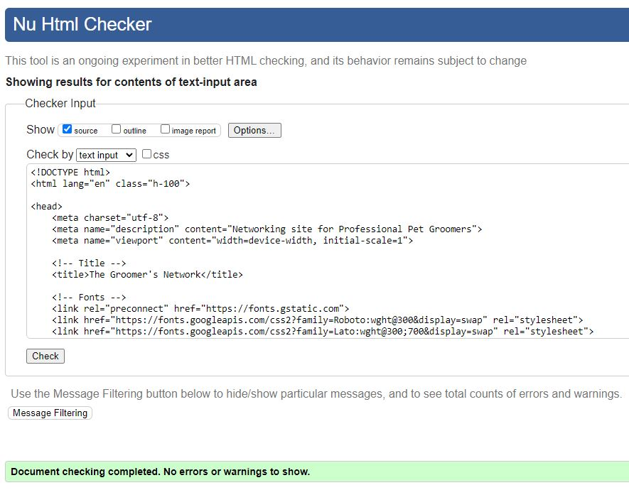
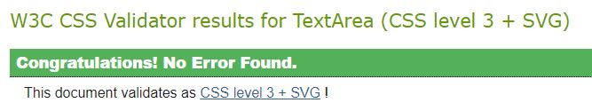
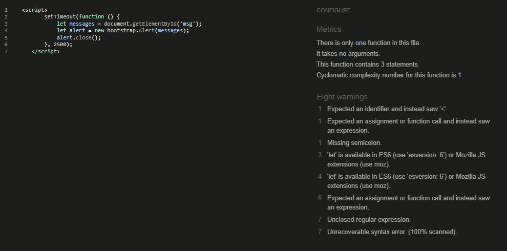
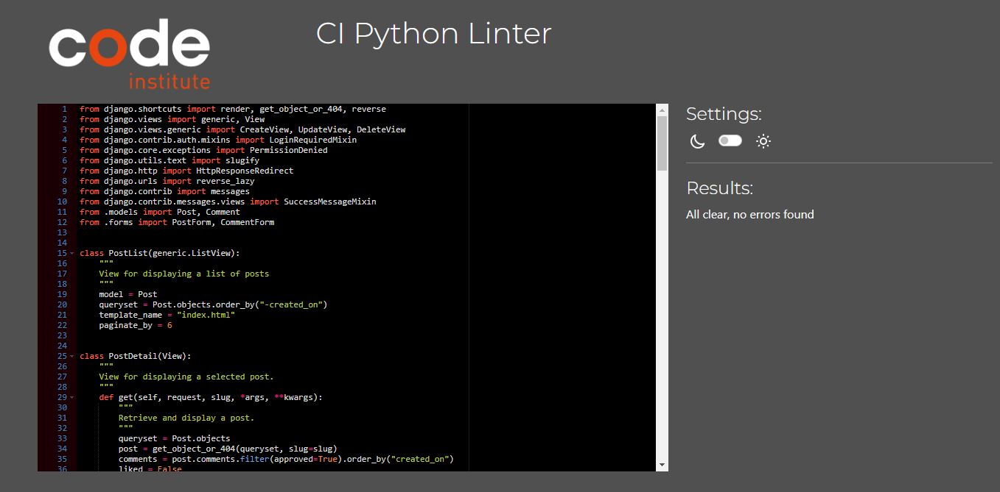
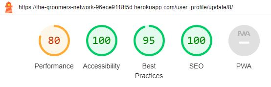

# Testing and Validation

## Contents
- [Code Validation](#code-validation)
    + [HTML](#html)
    + [CSS](#css)
    + [JavaScript](#javascript)
    + [Python](#python)
- [Responsiveness](#responsiveness)
- [Browser Compatibility](#browser-compatibility)
- [Accessibility](#accessibilty)
- [Manual Testing](#manual-testing)
    + [Landing Page and Navigation](#landing-page-and-navigation)
    + [Registration Page](#registration-page)
    + [Login Page](#login-page) 
    + [Home/Posts](#homeposts)
    + [Events](#events)
    + [My Profile](#my-profile)
    + [Logout Page](#logout-page)
    + [Admin Panel](#admin-panel)
    + [Defensive Programming](#defensive-programming)
- [User Story Testing](#user-story-testing)
---
## Code Validation
### HTML
All deployed templates were tested with the [W3C HTML Validator](https://validator.w3.org/nu/#textarea). To access code that is free of Jinja syntax I used Google DevTools and copied the code from the relevant file under the Sources tab. Note that user input data was not included in the validation eg. user bio, posts and comments. An example of an error-free check is shown below. 

 

| Template | Pass/Fail | Comment |
| --- | --- | --- |
| landing_page.html | PASS | |
| signup.html | FAIL |  Three errors of this type are present: 'The value of the for attribute of the label element must be the ID of a non-hidden form control.'|
| login.html | PASS ||
| index.html | PASS ||
| post_create.html | PASS ||
| post_update.html | PASS ||
| post_confirm_delete.html | PASS ||
| comment_confirm_delete.html | PASS ||
| event.html | PASS ||
| event_detail.html | PASS ||
| my_profile.html | PASS ||
| my_profile_update | PASS ||
| user_profile.html | PASS ||
| logout.html | PASS ||

### CSS
The CSS code was tested using [W3C CSS Validator](https://jigsaw.w3.org/css-validator/validator) and passed with no errror found. 

### JavaScript
A small amount of JavaScript was used for Messages in base.html. This raised two warnings in [JSHint Validator](https://jshint.com/), which I will go on to fix at a later date. Given such a small amount of JS was used and it passed in terms of functionality, this was not deemed a priority, within the time available. 

### Python
All Python files in each app were tested using [PEP8 CI Python Linter](https://pep8ci.herokuapp.com/). Python code passed in all cases with no errors or warnings. An example is shown below for views.py in the post app.

| App | Comments | Pass/Fail | 
| --- | --- | --- |
| event | all files passed with no errors | PASS |
| post | all files passed with no errors | PASS |
| pages | all files passed with no errors | PASS |
| user_profile | all files passed with no errors | PASS |
| directory level files | env.py has two lines that exceed max. line length, however I was unable to shorten the lines in a satisfactory way, and therefore deemed it acceptable | PASS |

---
## Responsiveness

DevTools was used continuously during development to ensure responsiveness across all screen sizes, using a mobile-first approach.
The deployed app was tested on the following devices.

| Device | Comments | Pass/Fail | 
| --- | --- | --- | 
| Iphone 5S | Displays and functions correctly  | PASS |
| Samsung S10 | Displays and functions correctly  | PASS |
| Windows 10 Pro | Displays and functions correctly  | PASS |

---
## Browser Compatability
The Groomer's Network has been thoroughly tested and shown to work well across the following browsers.

| Browser | Comments | Pass/Fail | 
| --- | --- | --- | 
| Chrome | Displays and functions correctly  | PASS |
| Safari | Displays and functions correctly  | PASS |
| Firefox | Displays and functions correctly  | PASS |
| Edge | Displays and functions correctly  | PASS |
---
## Accessibility
Care was taken during development to use semantic HTML, aria labels and alt attributes. All pages were tested using the Lighthouse tool in DevTools.

| Template | Score | Pass/Fail | 
| --- | --- |--- |
| landing_page.html | 100 | PASS |
| signup.html | 100| PASS |
| login.html | 100| PASS |
| index.html | 100 | PASS |
| post_create.html | 100 | PASS |
| post_update.html | 94 | PASS |
| post_confirm_delete.html | 94 | PASS |
| comment_confirm_delete.html | 94 | PASS |
| event.html | 100 | PASS |
| event_detail.html | 100 | PASSS |
| my_profile.html | 100 | PASS |
| my_profile_update | 100 | PASS |
| user_profile.html | 100 | PASS |
| logout.html | 100| PASS |

---
## Manual Testing
### Landing Page and Navigation
| Section | Test | Expected Result | Comment |Pass/Fail |
| --- | --- |--- | --- | --- |
| Navbar (unauthorised users) | Click on 'Register' | Directed to sign up page | | PASS |
|  | Click on 'Login' | Directed to sign in page | | PASS |
| Navbar (authorised users) | Click on logo | Directed to landing page | Navbar present and functioning correctly on all pages | PASS |
|  | Click on 'Home'  | Directed to home/posts page | Navbar present and functioning correctly on all pages | PASS |
|  | Click on 'Events' | Directed to events page | Navbar present and functioning correctly on all pages | PASS |
|  | Click on 'My Profile' | Directed to my profile page  | Navbar present and functioning correctly on all pages | PASS |
|  | Click on 'Logout' | Directed to sign out page | Navbar present and functioning correctly on all pages | PASS |
|  | Check active page on navbar | Active page text is black (non-active pages are grey) | | PASS |
| Navbar (small screens) | Check burger icon | At screen widths of 990px and below | Nav icon present and functioning correctly on all pages | PASS |
| Main (unauthorised users) | Click on 'Join for free!' | Directed to sign up page | | PASS |
| Main (authorised users) | Click on 'Start Networking!' | Directed to home/posts page | | PASS |
| Footer | Click on GitHub logo  | Developer's GitHub page opens in a new window | Footer present and functioning correctly on all pages | PASS |
|  | Click on LinkedIn logo | Developer's LinkedIn page opens in a new window | Footer present and functioning correctly on all pages | PASS |

### Registration Page
| Section | Test | Expected Result | Comment |Pass/Fail |
| --- | --- |--- | --- | --- |
| Link to sign in because you already have an account | Click on 'sign in' | Directed to login page | | PASS |
| Sign up form | Submit with empty form fields | Validation error '!Please fill in this field.' | This error appears for all mandatory fields | PASS |
|  | Submit with a username that is already used | Validation error 'A user with that username already exists.' | | PASS |
|  | Submit with an invalid password | Validation error 'This password is too common.' | | PASS |
|  |  | Validation error 'This password is entirely numeric.' | | PASS |
|  |  | Validation error 'You must type the same password each time.' | | PASS |
|  | Submit a valid form  | Directed to home/posts page | | PASS |
|  |  | Message 'Successfully signed in as {username}' | All messages disappear automatically after 2.5s | PASS |

### Login Page
| Section | Test | Expected Result | Comment |Pass/Fail |
| --- | --- |--- | --- | --- |
| Link to sign up because you don't have an account | Click on 'sign up' | Directed to registration page | | PASS |
| Sign in form | Submit with empty form fields | Validation error '!Please fill in this field.' | The error appears for all empty fields | PASS |
|  | Submit an invalid form | Validation error 'The username and/or password you specified are not correct.' | | PASS |
|  | Submit a valid form | Directed to home/posts page | | PASS |
|  |  | Message 'Successfully signed in as {username}' | All messages disappear automatically after 2.5s | PASS |

### Home/Posts
| Section | Test | Expected Result | Comment |Pass/Fail |
| --- | --- |--- | --- | --- |
| Post List | Ensure posts are displaying correctly on home/posts page | Image, author, title, tagline, created on date, number of likes and number of comments are displayed correctly | | PASS |
|  | Click on post author | Directed to that user's profile | | PASS |
| | Click 'Create a Post' | Directed to create a post page | | PASS |
| Pagination | Click on'Next' | Directed to next page of post list  | 'Next' and 'Prev' buttons appear correctly when there are multiple pages of posts (six to a page)  | PASS |
|  | Click on'Prev'  | Directed to previous page of post list  | | PASS |
| Create a Post Form | Submit form with empty fields | Validation error '!Please fill in this field.' | This error appears on mandatory fields (title and content) | PASS |
|  | Attempt to enter >40 characters in title or tagline fields | Form does not allow >40 characters to be entered  | | PASS |
|  | Attempt to enter >5000 characters in content field | Form does not allow >5000 characters to be entered | | PASS |
|  | Submit valid form | Directed back to home/posts page | | PASS |
|  |  | Message 'Your post has been published!' | All messages disappear automatically after 2.5s | PASS |
|  |  | New post appears in post list | If no image was uploaded, a placeholder image is shown | PASS |
| Read a Post | Click on image or post title from post list | Directed to post detail page | | PASS |
|  | Ensure post is displayed correctly | Image, author, title, tagline, created on date, number of likes, comments and comment form are displayed correctly  | | PASS |
|  | Click to read a post that was created by the logged in user | Update and Delete buttons are present | | PASS |
|  | Click on post author | Directed to that user's profile | | PASS |
|  | Toggle likes | Heart icons can be toggled, like count is correct | | PASS |
|  | Click on 'Edit Post' | Directed to Edit Post form | | PASS |
| Update a Post Form | Save Changes with empty fields | Validation error '!Please fill in this field.' | This error appears on mandatory fields (title and content) | PASS |
|  | Attempt to enter >40 characters in title or tagline fields | Form does not allow >40 characters to be entered  | | PASS |
|  | Attempt to enter >5000 characters in content field | Form does not allow >5000 characters to be entered | | PASS |
|  | Click on 'Cancel' | Directed back to post detail page | | PASS |
|  | Save changes with valid form | Directed back to post detail page | | PASS |
|  |  | Message 'Your post has been updated!' | All messages disappear automatically after 2.5s | PASS |
|  |  | Changes appear on post | | PASS |
| Delete a Post | Click on 'Delete Post' | Directed to post_confirm_delete page | | PASS |
|  | Click on 'Cancel' | Directed back to post detail page | | PASS |
|  | Click on 'Confirm' | Directed back to home/posts page | | PASS |
|  |  | Message 'Your post has been deleted!' | All messages disappear automatically after 2.5s | PASS |
|  |  | Post has been deleted | | PASS |
| Comments | Click on comment author from post detail page | Directed to that user's profile | | PASS |
|  | Check links for Delete are correct | Delete link is present only if logged in user wrote the comment | | PASS |
| Comment Form | Submit form with empty field | Validation error '!Please fill in this field.' |  | PASS |
|  | Attempt to enter >1000 characters in form field | Form does not allow >1000 characters to be entered | | PASS |
|  | Submit valid form | Message 'Your comment has been published!'  | All messages disappear automatically after 2.5s | PASS |
|  |  | New comment appears in comment list | | PASS |
| Delete a Comment | Click on 'Delete Comment' | Directed to comment_confirm_delete page | | PASS |
|  | Click on 'Cancel' | Directed back to post detail page | | PASS |
|  | Click on 'Confirm' | Directed back to post detail page | | PASS |
|  |  | Message 'Your comment has been deleted!' | All messages disappear automatically after 2.5s | PASS |
|  |  | Comment has been deleted | | PASS |

### Events
| Section | Test | Expected Result | Comment |Pass/Fail |
| --- | --- |--- | --- | --- |
| Event List | Ensure events are displaying correctly on Events page | Image, title, tagline, date, time, location and number of likes are displayed correctly | | PASS |
| Pagination | Click on'Next' | Directed to next page of event list  | 'Next' and 'Prev' buttons appear correctly when there are multiple pages of events (six to a page)  | PASS |
|  | Click on'Prev'  | Directed to previous page of event list  | | PASS |
| Read an Event | Click on image or event title from events list | Directed to event detail page | | PASS |
|  | Ensure event is displayed correctly | Image, title, tagline, date, time, location and number of likes are displayed correctly  | | PASS |
|  | Toggle likes | Heart icons can be toggled, like count is correct | | PASS |

### My Profile
| Section | Test | Expected Result | Comment |Pass/Fail |
| --- | --- |--- | --- | --- |
| My Profile | Ensure profile is displayed correctly | Username, full name, company name, location and bio are displayed correctly | | PASS |
|  | Click on 'Edit Profile' | Directed to Edit Profile form | | PASS |
| Update Profile Form | Attempt to enter >40 characters in full name, company name or location | Form does not allow >40 characters to be entered  | | PASS |
|  | Attempt to enter >1000 characters in bio field | Form does not allow >1000 characters to be entered | | PASS |
|  | Click on 'Cancel' | Directed back to My Profile | | PASS |
|  | Save changes with valid form | Directed back to my_profile page | All fields in this form are optional | PASS |
|  |  | Message 'Your profile has been updated!' | All messages disappear automatically after 2.5s | PASS |
|  |  | Changes appear on profile | | PASS |
| Other user's profiles | Click on an author from the home page or post detail page | Directed to a user's profile which is displayed correctly | | PASS |

### Logout Page
| Section | Test | Expected Result | Comment |Pass/Fail |
| --- | --- |--- | --- | --- |
| Main | Click to 'Sign out' | Directed to Landing page | | PASS |
|  |  | Message 'You have signed out' | All messages disappear automatically after 2.5s | PASS |

### Admin Panel
Admin can log into the administration panel to manage the content of the site. Each section of the admin panel has been customised and tested in terms of create, update and delete functionality, fields listed on panel, search fields, filters and form validation.

| Section | Comments |Pass/Fail |
| --- | --- |--- |
| Users | All functions work correctly  | PASS |
| Posts | All functions work correctly  | PASS |
| Comments |All functions work correctly  | PASS |
| Events | All functions work correctly.  Summernote editor tested  | PASS |

### Defensive Programming
Care was taken to ensure user's cannot access restricted functions, for example, by copying the URL of a page when logged in by User 1 and then accessing that same URL when logged in as User 2.

| Section | Test | Expected Result | Pass/Fail |
| --- | --- |--- |--- |
| Update a Post | Check that a user cannot update the post of another user by copying a URL | Custom Error 404 page | PASS |
| Delete a Post | Check that a user cannot delete the post of another user by copying a URL | Custom Error 403 page | PASS |
| Delete a Comment | Check that a user cannot delete the post of another user by copying a URL | Custom Error 404 page | PASS |
| Update a Profile | Check that a user cannot update the profile of another user by copying a URL | Custome Error 404 page | PASS |

---
## User Story Testing

| User Story | Acceptance Criteria | Pass/Fail | 
| --- | --- | --- |
| As a Site User, I am welcomed by a visually appealing landing page with intuitive navigation so that I can select to register or sign in to the site. | The landing page is inviting and easy to navigate to other pages of the site. | PASS |
| | The purpose of the site is immediately evident to new users. | PASS |
| As a Site User, I can register for an account so that I can sign in and have access to the complete functionality of the site. | From the landing page new users can register for an account by providing a username and optional email address. | PASS |
| | From the landing page, registered users can sign in to access their account. | PASS |
| | Users can easily sign out from the navbar. | PASS |
| | Authenticated users have full access to the site and functionality. | PASS |
| | Unauthenticated users have no access to the site, beyond the landing page and registration/signin pages. | PASS |
| As a Site User, I can immediately receive feedback when I make changes to data so that I understand what action I have just performed | Messages inform the user of all changes and actions they have performed. | PASS |
| | Messages automatically disappear after a set time. | PASS |
| As a Site User, I can create and manage my own posts so that I can network with other users | Users can create posts | PASS |
| | Users can select any post to view | PASS |
| | Users can update their own posts | PASS |
| | Users can delete their own posts | PASS |
| | Users should be shown a confirmation page before deleting a post, where they have the option to Cancel or Confirm. | PASS |
| | On deletion of a post, users should be redirected to posts page. | PASS |
| | On cancelling post deletion, users should be redirected back to the post detail view. | PASS |
| As a Site User, I can upload and view images so that posts are meaningful and engaging | Users can upload images together with the content of their posts | PASS |
| | Users can view images uploaded by other users/admin | PASS |
| | When a user does not upload an image, a placeholder image should be used. | PASS |
| As a Site User, I can view a list of posts so that I can click on a post to view the full content | All posts can be viewed by authorised users | PASS |
| | Users can select from a list of posts to view a particular post in detail | PASS |
| | Post titles can be clicked on to view the post in more detail | PASS |
| As a Site User, I can view several posts on each page so that I can easily navigate between pages to view the content | The user should be able to view up to 6 posts on the page | PASS |
| | Buttons allow easy navigation forwards and backwards between pages | PASS |
| As a Site User, I can manage my comments on posts so that I can be a part of the conversation | Users can comment on posts | PASS |
| | Users can view all comments on the post | PASS |
| | Users can delete their own posts | PASS |
| | On deletion of a comment, user should have the option to confirm or cancel the deletion. | PASS |
| | User should be redirected to relevant post after cancelling deletion of a comment | PASS |
| | User should be redirected to relevant post after deletion of a comment. | PASS |
| As a Site User, I can like or unlike a post so that I can interact with the content | Users can toggle like/unlike by clicking on heart icon | PASS |
| | Users can see immediately if they have liked a post. | PASS |
| | Users can view the number of likes on a post | PASS |
| As a Site User, I can view a list of events and click on an event so that I can read the full content | Events can be added by admin only | PASS |
| | Users can select from a list of events to view a particular event | PASS |
| As a Site User, I can view several events on each page so that I can easily navigate between pages | The user should be able to view up to 6 events on the page | PASS |
| | Buttons allow easy navigation forwards and backwards between pages | PASS |
| As a Site User, I can like or unlike an event so that I can interact with the content | Users can toggle like/unlike by clicking | PASS |
| | Users can view the number of likes on an event | PASS |
| | Users can immediately see if they have liked an event | PASS |
| As a Site Admin, I can create and manage events so that they can be shared with the user | Site Admin can use Summernote editor to make Events visually more appealing | PASS |
| | Site Admin can post, update and delete events | PASS |
| | Users can navigate from the home page to view a list of events | PASS |
| | Users can select an event to view in more detail | PASS |
| As a Site User, I can manage my profile so that I can display and update my details as necessary | An empty user profile is created automatically on registration of a new user | PASS |
| | Users can read and update their profile | PASS |
| | Users can easily navigate to their profile from the navbar | PASS |
| As a Site User, I can click on the username of another site user so that I can view their profile | A user can click on the author of a post to view that user's profile. | PASS |
| | A user can click on the author of a comment to view that user's profile. | PASS |
| As a Site Admin, I can use a dedicated admin panel so that I can delete any inappropriate content and manage the content of the site | Site admin can log in to admin panel | PASS |
| | Site admin can create, read, update and delete posts and comments | PASS |
| | Site admin can view a list of registered users and delete if necessary | PASS |
| | Site admin can filter posts and comments by created on date | PASS |
| | Site admin can use search function to locate a specific post, comment or profile | PASS |

---
