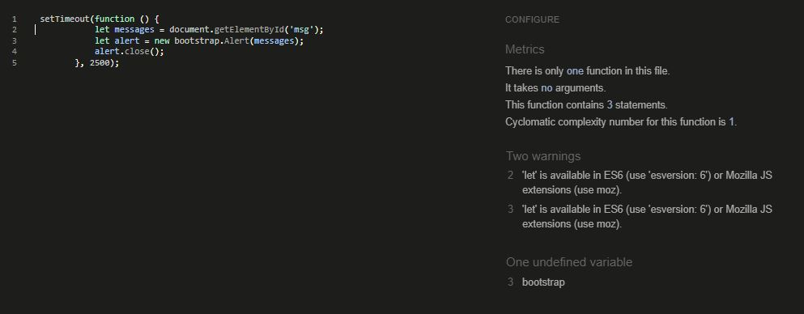

# Testing and Validation
---
## Contents
- [Code Validation](#code-validation)
    + [HTML](#html)
    + [CSS](#css)
    + [JavaScript](#javascript)
    + [Python](#python)
- [Responsivity](#responsivity)
- [Browser Compatibility](#browser-compatibility)
- [Accessibility](#accessibilty)
- [Manual Testing](#manual-testing)
    + [Landing Page](#landing-page)
    + [Registration Page](#registration-page)
    + [Login Page](#login-page)
    + [Navigation](#navigation)
    + [My Profile Page](#my-profile-page)
    + [Home/Posts Page](#homeposts-page)
    + [Events Page](#events-page)
    + [Logout Page](#logout-page)
- [User Story Testing](#user-story-testing)
---
## Code Validation
### HTML
All deployed templates were tested with the [W3C HTML Validator](https://validator.w3.org/nu/#textarea) and passed in all cases with no errors or warnings. An example is shown below for the landing page. 

### CSS
The CSS code was tested using [W3C CSS Validator](https://jigsaw.w3.org/css-validator/validator) and passed with no errror found. 

### JavaScript
A small amount of JavaScript was used for Messages in base.html. This did raise eight errors in [JSHint Validator](https://jshint.com/), which I will go on to fix at a later date. Given such a small amount of JS was used and it passed in terms of functionality, this was not deemed a priority. 

### Python
All Python files were tested using [PEP8 CI Python Linter](https://pep8ci.herokuapp.com/). Python code passed in all case with no errors or warnings. An example is shown below for views.py in the post app.

---
## Responsivity
---
## Browser Compatability
The Groomer's Network has been thoroughly tested and shown to work well across the following browsers.
- Chrome
- Safari
- Firefox
- Edge
---
## Accessibility
---
## Manual Testing

### Landing Page
### Registration Page
### Login Page
### Navigation
### My Profile Page
### Home/Posts Page
### Events Page
### Logout Page

---
## User Story Testing

| User Story | Acceptance Criteria | Pass/Fail | 
| --- | --- | --- |
| As a Site User, I am welcomed by a visually appealing landing page with intuitive navigation so that I can select to register or sign in to the site. | The landing page is inviting and easy to navigate to other pages of the site. | PASS |
| | The purpose of the site is immediately evident to new users. | PASS |
| As a Site User, I can register for an account so that I can sign in and have access to the complete functionality of the site. | From the landing page new users can register for an account by providing a username and optional email address. | PASS |
| | From the landing page, registered users can sign in to access their account. | PASS |
| | Users can easily sign out from the navbar. | PASS |
| | Authenticated users have full access to the site and functionality. | PASS |
| | Unauthenticated users have no access to the site, beyond the landing page and registration/signin pages. | PASS |
| As a Site User, I can immediately receive feedback when I make changes to data so that I understand what action I have just performed | Messages appear when a user makes changes to the data | PASS |
| | Messages automatically disappear after a set time. | PASS |
| | Messages inform the user of all changes and actions they have performed. | PASS |
| As a Site User, I can create and manage my own posts so that I can network with other users | Users can create posts | PASS |
| | Users can select any post to view | PASS |
| | Users can update their own posts | PASS |
| | Users can delete their own posts | PASS |
| | Users should be shown a confirmation page before deleting a post, where they have the option to Cancel or Confirm. | PASS |
| | On deletion of a post, users should be redirected to posts page. | PASS |
| | On cancelling post deletion, users should be redirected back to the post detail view. | PASS |
| As a Site User, I can upload and view images so that posts are meaningful and engaging | Users can upload images together with the content of their posts | PASS |
| | Users can view images uploaded by other users/admin | PASS |
| | When a user does not upload an image, a placeholder image should be used. | PASS |
| As a Site User, I can view a list of posts so that I can click on a post to view the full content | All posts can be viewed by authorised users | PASS |
| | Users can select from a list of posts to view a particular post in detail | PASS |
| | Post titles can be clicked on to view the post in more detail | PASS |
| As a Site User, I can view several posts on each page so that I can easily navigate between pages to view the content | The user should be able to view up to 6 posts on the page (depending on screen size) | PASS |
| | Buttons allow easy navigate forward and backward between pages | PASS |
| As a Site User, I can manage my comments on posts so that I can be a part of the conversation | Users can comment on posts | PASS |
| | Users can view all comments on the post | PASS |
| | Users can delete their own posts | PASS |
| | On deletion of a comment, user should have the option to confirm or cancel the deletion. | PASS |
| | User should be redirected to relevant post after cancelling deletion of a comment | PASS |
| | User should be redirected to relevant post after deletion of a comment. | PASS |
| As a Site User, I can like or unlike a post so that I can interact with the content | Users can toggle like/unlike by clicking on heart icon | PASS |
| | Users can see immediately if they have liked a post. | PASS |
| | Users can view the number of likes on a post | PASS |
| As a Site User, I can view a list of events and click on an event so that I can read the full content | Events can be added by admin only | PASS |
| | Users can select from a list of events to view a particular event | PASS |
| As a Site User, I can view several events on each page so that I can easily navigate between pages | The user should be able to view up to 6 events on the page (depending on screen size) | PASS |
| | Buttons allow easy navigate forward and backward between pages | PASS |
| As a Site User, I can like or unlike an event so that I can interact with the content | Users can toggle like/unlike by clicking | PASS |
| | Users can view the number of likes on an event | PASS |
| | Users can immediately see if they have liked an event | PASS |
| As a Site Admin, I can create and manage events so that they can be shared with the user | Site Admin can use Summernote editor to make Events visually more appealing | PASS |
| | Site Admin can post, update and delete events | PASS |
| | Users can navigate from the home page to view a list of events | PASS |
| | Users can select an event to view in more detail | PASS |
| As a Site User, I can manage my profile so that I can display and update my details as necessary | An empty user profile is created automatically on registration of a new user | PASS |
| | Users can read and update their profile | PASS |
| | Users can easily navigate to their profile from the navbar | PASS |
| As a Site User, I can click on the username of another site user so that I can view their profile | A user can click on the author of a post to view that user's profile. | PASS |
| | A user can click on the author of a comment to view that user's profile. | PASS |
| As a Site Admin, I can use a dedicated admin panel so that I can delete any inappropriate content and manage the content of the site | Site admin can log in to admin panel | PASS |
| | Site admin can create, read, update and delete posts and comments | PASS |
| | Site admin can view a list of registered users and delete if necessary | PASS |
| | Site admin can filter posts and comments by created on date | PASS |
| | Site admin can use search function to locate a specific post, comment or profile | PASS |

---

